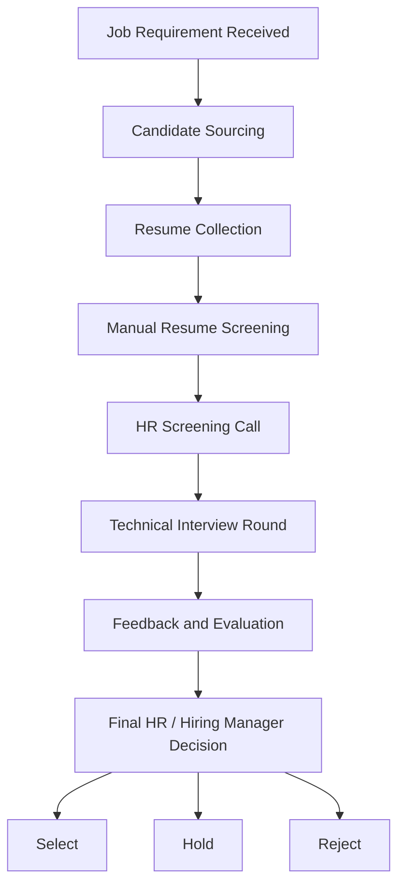

# HireX - Current Process Flow Diagram

**Document purpose:** Document the existing as-is recruitment workflow before HireX AI automation.

**Project:** HireX - AI-Powered Interview System  
**Domain:** HR Technology (HRTech) - Talent Acquisition and Recruitment Automation

---

## 1. Current As-Is Process Flow

```text
Job Requirement Received
        |
        v
Candidate Sourcing
(LinkedIn / Naukri / Referrals / Emails / Portals)
        |
        v
Resume Collection
        |
        v
Manual Resume Screening
        |
        v
HR Screening Call
        |
        v
Technical Interview Round
        |
        v
Feedback and Evaluation
        |
        v
Final HR / Hiring Manager Decision
        |
        v
Select / Hold / Reject
```

---

## 2. Mermaid Flow Diagram



---

## 3. Process Summary

The current recruitment process begins with receiving a job requirement, sourcing candidates, collecting resumes, manually screening profiles, conducting HR and technical interviews, and then making a final hiring decision. Most steps are handled manually or through separate tools, which increases recruiter workload, slows down hiring, and creates inconsistent candidate evaluation.
