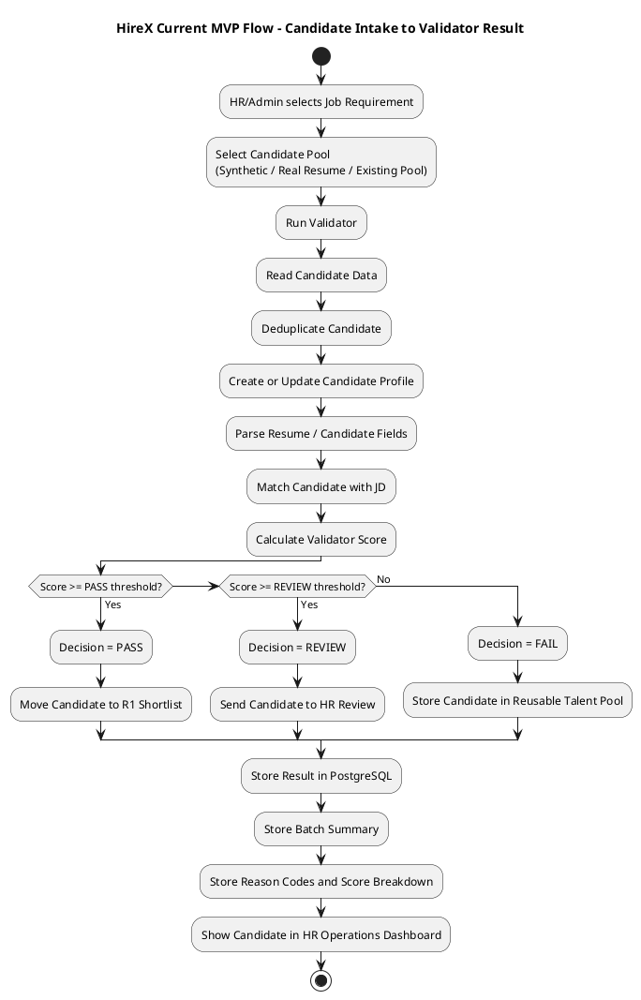
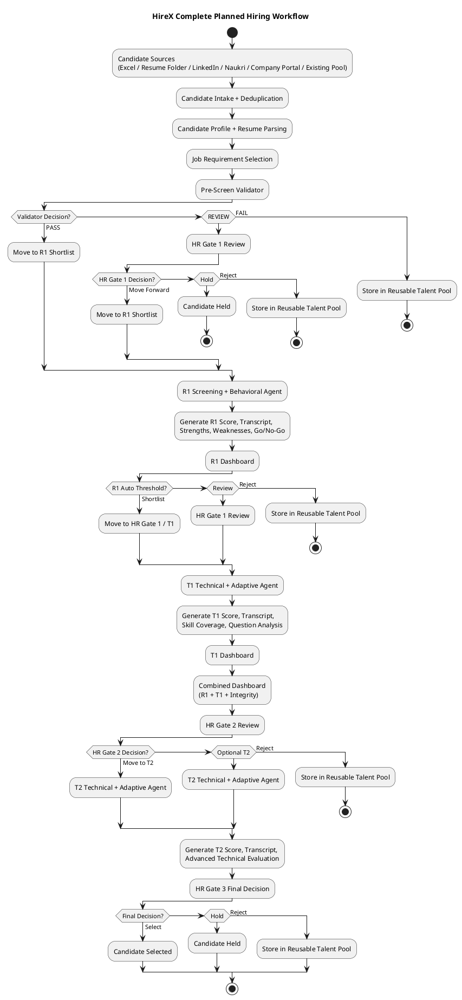
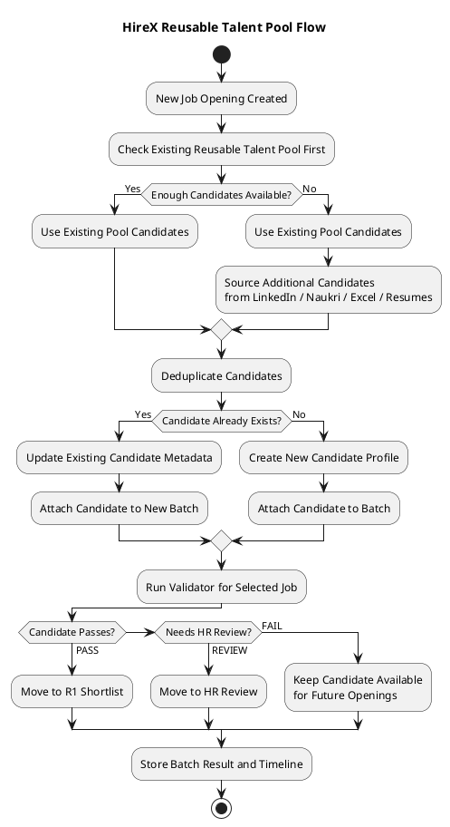
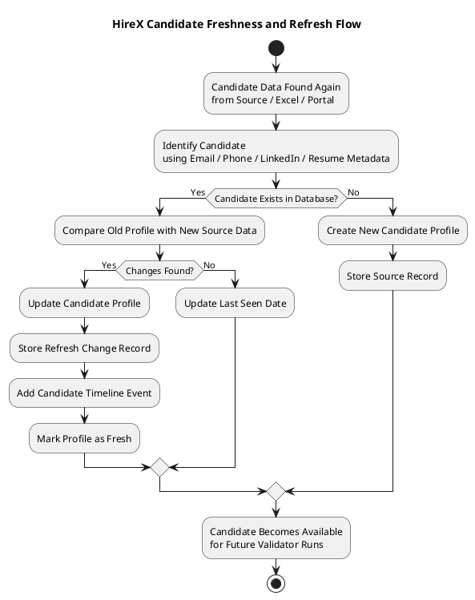
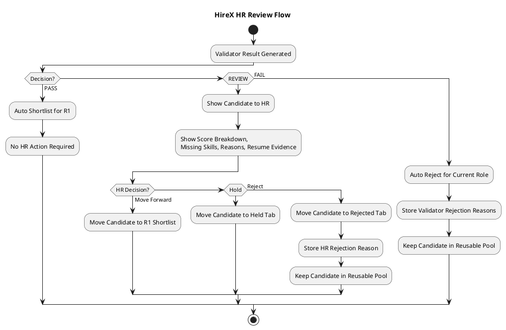
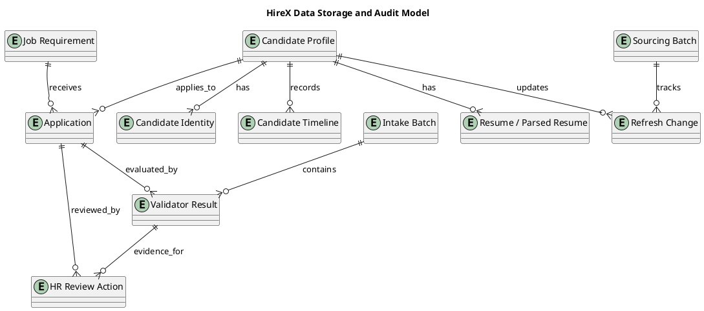

# HireX - Workflow and Architecture Diagrams

**Document purpose:** Explain the HireX process flow using PlantUML diagrams, covering both the currently implemented MVP workflow and the complete planned architecture.

**Project:** HireX - AI-Powered Interview System  
**Domain:** HRTech - Talent Acquisition and Recruitment Automation  
**Status:** MVP implemented for candidate intake, validator, batches, reusable pool, HR dashboard, reason bank, validator versioning, and refresh metadata. Future phases will extend this into R1, T1, T2, integrity monitoring, M1 intelligence, and HR co-pilot.

---

## 1. Current Implemented MVP Flow

This diagram shows the flow that is currently implemented in the project. Candidate data comes from Excel/source files, a job requirement is selected, the validator runs, results are stored in PostgreSQL, and HR can review candidates from the dashboard.

---

## 2. Current MVP Components Implemented

| Component | Status | Purpose |
|-----------|--------|---------|
| Candidate Excel/source intake | Implemented | Reads candidate data for validation. |
| Job requirement input | Implemented | Stores JD, role, skills, experience, salary, and thresholds. |
| Candidate deduplication | Implemented | Avoids storing same candidate again and again. |
| Pre-screen validator | Implemented | Scores candidates and classifies them as PASS, REVIEW, or FAIL. |
| Batch tracking | Implemented | Tracks every validator execution by batch. |
| HR operations dashboard | Implemented | Shows candidates, scores, status, and evidence. |
| Reusable talent pool | Implemented | Stores rejected/available candidates for future roles. |
| Candidate refresh metadata | Implemented | Tracks updated candidate profile changes. |
| Reason bank | Implemented | Stores structured rejection/HR decision reasons. |
| Validator versioning | Implemented | Stores validator, parser, scoring, and policy versions. |

---

## 3. Complete Planned HireX Hiring Flow

This is the complete planned HireX process based on the architecture. It includes the current validator flow plus future R1, T1, T2, HR gates, integrity monitoring, M1 intelligence engine, and HR co-pilot.

---

## 4. Reusable Talent Pool and Future Opening Flow

This flow explains the lead's updated approach. Rejected candidates are not simply lost. They are stored once in the candidate database and reused for future job openings.

---

## 5. Candidate Freshness / Periodic Update Flow

This flow explains the periodic update concept. If a candidate appears again after some time with new skills, projects, certifications, or experience, HireX updates the existing profile instead of creating duplicate records.

---

## 6. HR Review Flow for Middle Threshold Candidates

In HireX, HR action is required only for candidates in the middle review band. Candidates above the pass threshold are automatically shortlisted for R1, and candidates below the review threshold are automatically rejected for that role.

---

## 7. Data Storage and Audit Flow

This diagram shows how the main data is stored. The goal is to keep one master candidate record and connect it to multiple jobs, batches, validator results, and HR decisions.

---

## 8. What Is Implemented vs Future

### Implemented Now

- Candidate pool intake from Excel/source files.
- Job requirement selection and active/draft/inactive handling.
- Candidate deduplication and identity matching.
- Pre-screen validator with PASS, REVIEW, FAIL outcomes.
- Batch-based execution and dashboard filtering.
- PostgreSQL storage for candidate, job, application, resume, parsed resume, validator result, batch, HR decision, and timeline data.
- Reusable talent pool for rejected/available candidates.
- Profile freshness and refresh change tracking.
- Reason bank and structured rejection reasons.
- Validator versioning and scoring metadata.
- HR operations dashboard for candidate evidence and decisions.

### Planned Next

- Real sourcing integrations from LinkedIn, Naukri, Indeed, Internshala, and company portals.
- R1 screening and behavioral agent.
- R1 dashboard with transcript, strengths, weaknesses, and go/no-go signal.
- T1 technical and adaptive agent.
- T1 dashboard with technical score, skill coverage, and question analysis.
- T2 advanced technical and adaptive agent.
- D1 passive integrity monitor for tab switch, copy-paste, face presence, multiple people, mic/audio, and screen/window anomalies.
- M1 master intelligence engine for capacity prediction, T2 necessity prediction, hiring forecast, knowledge graph, and interview question ROI.
- HR co-pilot for candidate summary, red flags, recommendation, and final questions.
- Candidate, recruiter, HR, and admin dashboards for full workflow coverage.

---

## 9. Summary

The current implemented HireX workflow covers candidate intake, validation, batch tracking, reusable pool storage, HR review, and audit-ready scoring. The planned full architecture extends this foundation into AI-based interviews, technical assessment, behavioral screening, integrity monitoring, intelligence dashboards, and HR co-pilot support. This phased approach allows the team to start with a strong validator and data foundation, then add R1, T1, T2, HR gates, D1, M1, and co-pilot features without changing the core candidate database design.
